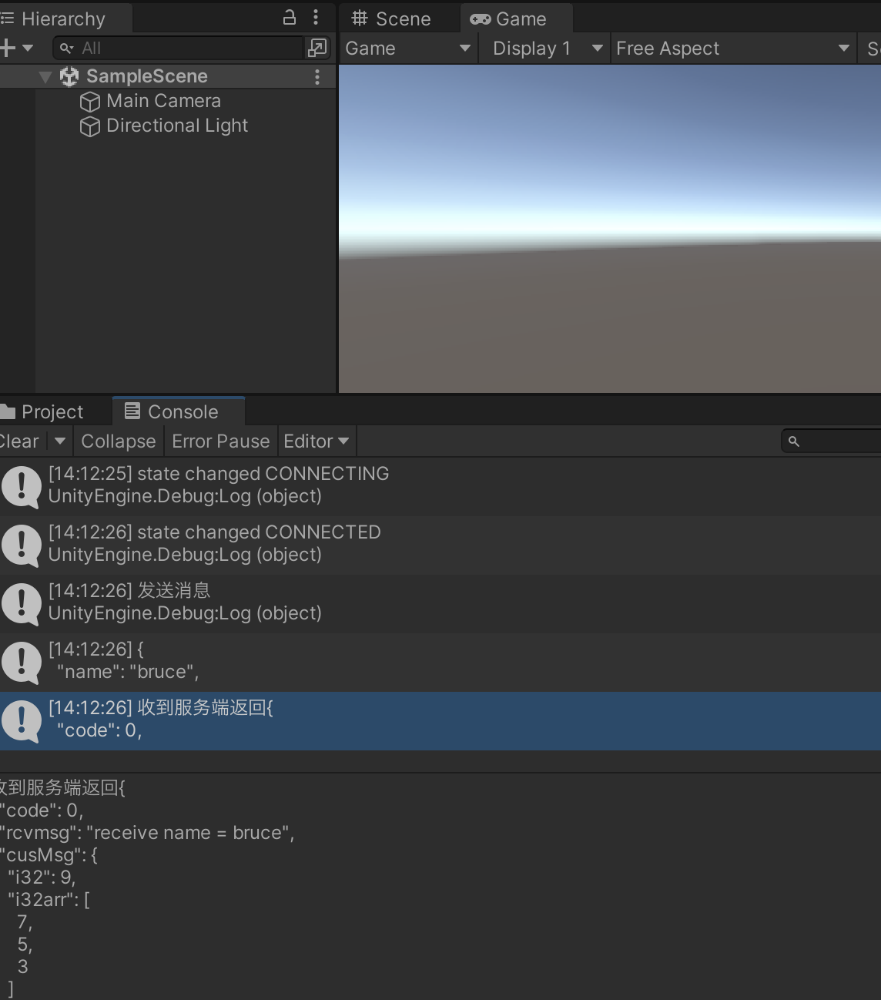

# 目的
此项目是 [pinus-protobuf-plugin](https://github.com/bruce48x/pomelo-protobuf-plugin) 和 [pinus-unityclient-socket](https://github.com/bruce48x/pomelo-unityclient-socket) 的使用示例

- 此repo 原source為 [Unity3D demo](https://github.com/bruce48x/example-pinus-unity-client)

`server/` 目录是 pinus 服务端 (原source的版本)

`server2/` 目录是 pinus 服务端 做版本升級如下
- 作業系統：MacOS
- nodejs v12.14.0, v16.13.1
- "pinus": "1.6.4",
- "pinus-protobuf-plugin": "^2.0",
- More detail see also `server2/package.json

`cleint/` 目录是 unity 2021.3.5f1 创建的客户端（原source 2019版本做升級處理）
- 作業系統：MacOS 12.6
- [pinus-unityclient-socket](https://github.com/cmcreborn/pomelo-unityclient-socket) from [bruce48x](https://github.com/bruce48x/pomelo-unityclient-socket) 2022.11.24.
- 執行結果:

需要注意：
* 这些代码是示例，所用到的库不一定是最新的，真正使用时还是到 [pinus-unityclient-socket](https://github.com/bruce48x/pomelo-unityclient-socket) 去获取代码。